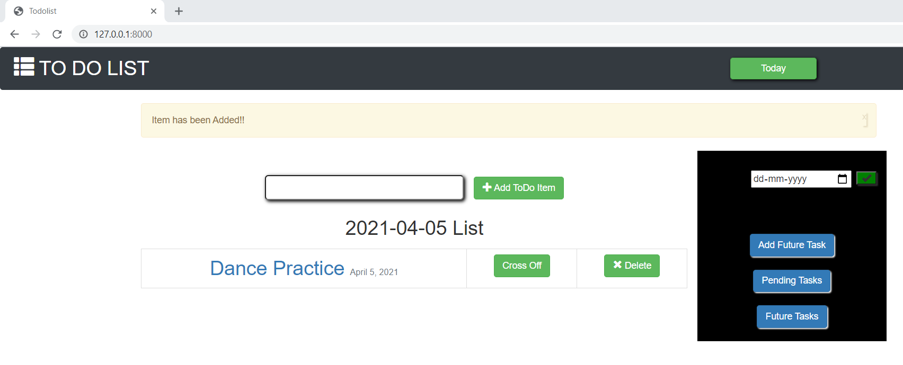

# django-JUSTDo


JustDo - is not only your simple todolist which allows one to mark completed or uncompleted tasks and also to delete a specific task. 
We can rename a particular task.
The list also shows you the current-day task and one can also list down the future tasks and manage them or see them by specifying the date.
One can also keep a check on pending tasks.
Teammates - Vaibhavi Kundle and Rasika Joshi.

# Getting Started

The following will get you a copy of project up on your local machine for development and testing purposes.

## Prerequisites
```
Python and Django on your local machine
PyCharm or VsCode for running the code
```

- Clone the Repo  ```git clone https://github.com/vaibhavi19-gif/tododjango.git```
- Open the file in VsCode or PyCharm.
- Move to directory
``` 
cd todolist
```
- Run the following command on terminal:

```
python manage.py makemigrations
python manage.py migrate
python manage.py runserver

```

# ScreenShots

<p align="center">
<h3>Add Tasks</h3>

<h3>Add Future Tasks</h3>

<h3>View Future Tasks</h3>

<h3>Cross the Completed Tasks</h3>

</p>

# Authors


@vaibhavi19-gif

@rasika2112
  


